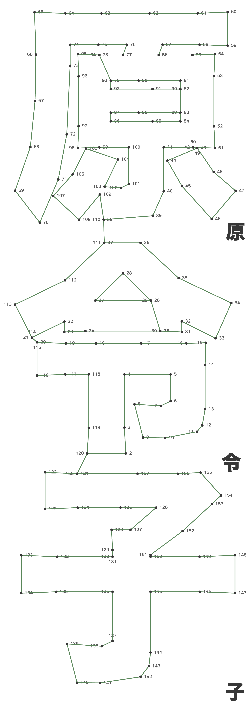

# About

Create a dot-to-dot / connect-the-dots layout puzzle from a string of text. Initially made to work with Kanji/Chinese glyphs but works with any character, provided a suitable font.

## Features

- Convert input text and font into dot-to-dot layout.
- Reduce the number of dots in the path (to make the underlying shape less obvious) with adjustable distance and angle thresholds.
- Optionally draw connecting lines between dots and show characters.

---

## Usage

Install dependencies:

```bash
pip install -r requirements.txt
```

Generate dot-to-dot layout:

```bash
python3 create_dot_to_dot_layout.py --text <text> --font <path_to_font> [optional arguments]
```

## Example

```bash
python3 create_dot_to_dot_layout.py --text "原令子" --font "fonts/hiragino-kaku-gothic-std-w8.otf" --dots 200 --distance_threshold 120 --angle_threshold 160 --show_chars --draw_lines
```

### Result

The leftmost image is the same as the right but with `--show_chars --draw_lines`

<div align="center">
  
  
</div>

## Arguments

### Required Arguments

| Argument | Description             |
| -------- | ----------------------- |
| `--text` | Text to convert to SVG. |
| `--font` | Path to the font file.  |

### Optional Arguments

| Argument                | Description                                                    | Default     |
| ----------------------- | -------------------------------------------------------------- | ----------- |
| `--dots`                | Number of dots to generate per character before dot reduction. | `100`       |
| `--output`              | Path to save the output PDF.                                   | `Automatic` |
| `--distance_threshold`  | Distance threshold for reducing points.                        | `20`        |
| `--angle_threshold`     | Angle threshold for reducing points.                           | `160`       |
| `--show_chars`          | Show character hints (debugging mode).                         | `False`     |
| `--draw_lines`          | Draw lines between dots.                                       | `False`     |
| `--visual_label_offset` | Multiplier to adjust the visual distance of labels from dots.  | `0.4`       |

## To-do

- add support for other languages e.g. arabic
- add option to choose which direction to stack characters (horizontal/vertical)
- add option for output file format
- create simple gui
